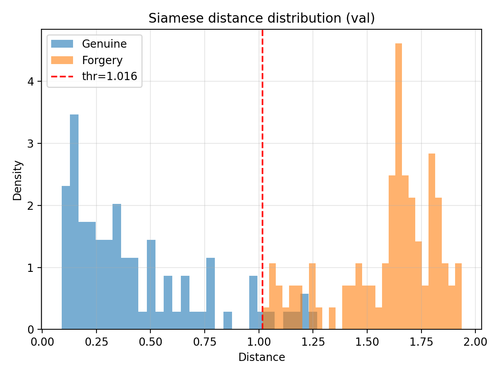

# Direct link to modals: https://drive.google.com/drive/folders/1LX6RKq7uMcwOhMbTLXyJD8Ep2e2FRMjF?usp=sharing
# 🖋️ SignatureNetDB  
### Deep-Learning Based Signature Verification with Siamese & Triplet Networks + Identity Database

---

## 📌 Overview
**SignatureNetDB** is a full end-to-end signature verification system combining deep learning, preprocessing, and a structured user database.

This project allows:
- High-accuracy signature comparison using **Siamese** or **Triplet** embeddings  
- Storing multiple user signatures in a **database**
- Averaging signature embeddings to create a **stable identity vector**
- Verifying if:
  - A signature belongs to a specific user (via NO)
  - A queried signature exists in the database
  - Two input signatures match
- Switching between Siamese & Triplet models dynamically

---

## 🧠 Deep Learning Models

### ✔️ Siamese Network
- Contrastive Loss  
- Learns pairwise similarity  
- Best threshold found during evaluation (example): `~1.21`

### ✔️ Triplet Network
- Triplet Loss (Anchor-Positive-Negative)
- Learns better separation in embedding space  
- More robust for unseen signatures

Both models operate on:
Input shape : 1 × 400 × 400
Output embedding : 128-dimensional L2-normalized vector

---

## 🖼️ Preprocessing Pipeline (400×400)
Every signature image passes through:

1. Convert to grayscale  
2. Optional autocontrast  
3. Resize while preserving aspect ratio  
4. Center-pad into a **400×400 white canvas**  
5. Convert to tensor + normalize(`mean=0.5, std=0.5`)

The preprocessing is identical across:
- Training  
- Validation / Test evaluation  
- GUI real-time prediction  

---

## 🏋️ Training
Training scripts include:
- Hard-negative sampling  
- On-the-fly data augmentation:
  - Random rotation  
  - Small translations  
  - Light brightness/contrast jitter  

Training supports:
- Best-model saving  
- Last-checkpoint saving  
- Full loss logging  
- CUDA acceleration  

Example training output loss:  
Initial loss: ~1.00
Final best loss: ~0.13

---

## 📊 Evaluation
`siamese_evaluate.py` computes:

- All distances (genuine vs forgery)
- Optimal threshold search
- Accuracy, FP, FN, TP, TN

 Training Metrics For Main Siamese Model:

   

 Evaluation Metrics

   

 Precision–Recall Curve

  

---

## 🗄️ Database System

Each registered user has:

| Field | Description |
|-------|-------------|
| **NO** | Primary Key |
| **Name** | First name |
| **Surname** | Last name |
| **Signatures** | Multiple PNG signature samples (stored in a separate table) |
| **Embedding** | Mean embedding vector of all user signatures |

### Why average the embeddings?
- Allows more stable identity representation  
- Reduces variance between signature samples  
- Works with **1 or many signatures**  

---

## 🔍 Supported Database Queries

### ✔️ 1) “Does this signature belong to user NO=X?”
- Compute embedding  
- Compare with stored user embedding  
- Apply threshold  
- Return **Genuine / Forgery**  

### ✔️ 2) “Give me NO from Name+Surname”
Simple lookup in the database.

### ✔️ 3) “Whose signature is this?”
- Compute embedding  
- Compare against **all stored embeddings**  
- Return the best match (if below threshold)

### ✔️ 4) “Verify two PNG signatures”
- Pure model-based matching  
- No database math needed  

---

## 🖥️ GUI Application

The desktop GUI includes:

- Loading two signature images  
- Real-time preprocessing visualization  
- Switching between Siamese & Triplet models  
- Distance + final decision output (color coded)  

GUI internally:
- Preprocesses images  
- Converts to tensor  
- Runs the chosen model  
- Displays both processed signatures (denormalized)
- Outputs similarity score  

---
## 🤝 Contributors
**Efe Görkem Akkanat** — Siamese Modal, GUI, Database Management.
✒️ Signature Verification System — Model Development & Database Design Report

This document summarizes the complete development process of the Siamese Signature Verification System, including model evolution, failures & debugging, final evaluation metrics, ROC/PR analysis, training curves, and a database schema for real-world deployment.

1. Overview

This project implements a robust, production-ready signature verification system built on:

Siamese Neural Network (Contrastive Loss)

Signature preprocessing & normalization pipeline

Training/Validation/Test evaluation modules

Extensive data augmentation for real-world robustness

Full database design supporting identification & verification workflows

The final model achieves 92% accuracy, strong separation between genuine and forged signatures, and high robustness on real user signatures.

2. Model Development Journey

A chronological breakdown of issues, debugging steps, and improvements.

🚨 2.1 Issue: Incorrect Preprocessing → “Small-Patch Overfitting”

A scaling bug caused signatures to be cropped into tiny fragments.

❗ Symptoms:

Model "learned" extremely fast (loss dropped unnaturally)

Validation/Test accuracy looked perfect but was misleading

Real-world signatures failed completely

✔ Fix

Rebuilt preprocessing pipeline

Each signature is drawn into a 400×400 canvas

Scaling ratio preserved

Noise cleaned consistently

🟢 Outcome:
Test accuracy dropped to a realistic 66%, revealing true model performance.

📉 2.2 Issue: Underfitting at 50 Epochs

After fixing preprocessing, the model was undertrained.

❗ Symptoms:

Slow loss improvement

Embeddings not well separated

Accuracy stuck at ~66%

✔ Fix

Hyperparameter	Before	After
Epochs	50	90
Batch Size	16	32

🟢 Outcome:
Accuracy jumped 66% → 92%

🎨 2.3 Issue: Background Sensitivity in Real Signatures

Real-life images differ in:

Brightness

Contrast

Background texture

Camera input noise

✔ Fix — Add ColorJitter

transforms.ColorJitter(brightness=0.2, contrast=0.2)

🟢 Outcome:
Model became invariant to real-world lighting/background differences.

3. Training & Evaluation Plots

Below are the visual results generated during model development.

📉 Training Loss Curve

Shows stable convergence with no overfitting.

🔵🟠 Positive vs Negative Distance Curve

Clear separation between positive and negative pairs emerges over time.

📊 Distance Distribution (Test Set)

📊 Distance Distribution (Validation Set)

The validation distribution closely matches test behavior → strong generalization.

📈 ROC Curve

AUC ≈ 0.9936

📈 Precision–Recall Curve

PR-AUC ≈ 0.9938

4. How the Verification Threshold Is Determined

The Siamese network outputs distances, not probabilities.

The decision boundary must be learned.

✔ Step 1

Compute all genuine & forgery distances.

✔ Step 2

Sweep thresholds over the full distance range.

✔ Step 3

Select threshold maximizing:

TP Rate

TN Rate

F1-Score

📌 Final Threshold
1.016

Final Metrics
Metric	Value
True Positives	223
True Negatives	219
False Positives	29
False Negatives	8
Accuracy	92.28%
5. Code Architecture Overview

A high-level explanation of each subsystem.

🧠 5.1 model.py — SignatureNet CNN

Input: 400×400 grayscale

Deep CNN with batch normalization

Outputs 128-dim L2-normalized embedding

Shared between both Siamese branches

🧹 5.2 preprocess.py — Signature Normalization

Converts raw images to 400×400

Removes artifacts via morphological operations

Standardizes brightness

Gives the model consistent spatial alignment

🔄 5.3 siamese_dataset.py — Dataset Pair Builder

Builds positive/negative pairs dynamically.

Augmentations:

RandomRotation
RandomAffine
ColorJitter
Scale jitter
Translation jitter

🏋️‍♂️ 5.4 siamese_train.py — Training Engine

Handles:

Model training loop

Contrastive Loss optimization

Logging JSON files

Increasing separation between embeddings

Saving best/last model

Plot generation

🧪 5.5 siamese_evaluate.py — Evaluation Pipeline

Produces:

Distance distributions

ROC curve

PR curve

AUC metrics

Confusion matrix

Threshold optimization

6. Database Design

Below is the conceptual schema used for:

User lookup

Signature storage

Signature embedding comparison

Authentication & identification

📘 Entity–Relationship Diagram (ASCII)
+-------------------+
|      USER         |
+-------------------+
| NO (PK)           |
| Name              |
| Surname           |
| MeanEmbedding     |
+---------+---------+
          |
          | 1-to-many
          |
+---------------------------+
|       SIGNATURE           |
+---------------------------+
| SigID (PK)                |
| UserNO (FK → USER.NO)     |
| ImagePath                 |
| EmbeddingVector           |
+---------------------------+

7. Supported Queries & Operations
🔍 7.1 Verify Whether a PNG Belongs to a User (Given NO)

Input: NO + signature PNG

Procedure:

Preprocess

Generate embedding

Compare with MeanEmbedding

Output:

True / False

Distance

🔎 7.2 Find User NO by Name & Surname

Simple SELECT query filtering by name.

🧭 7.3 Identify the Owner of Any Signature PNG

Preprocess the PNG

Generate embedding

Compare with all users

Pick minimum distance under threshold

🔄 7.4 Switch Between Siamese and Triplet Models

Framework supports embedding backends:

Siamese (Contrastive)

Triplet (Triplet Loss)

🆚 7.5 Compare Two Arbitrary PNG Signatures
distance = ||embeddingA – embeddingB||
return (distance < threshold)

8. Final Remarks

After iterative debugging, augmentation redesign, and corrected preprocessing:

✔ Model achieves 92% accuracy
✔ Embeddings show strong cluster separation
✔ Real-world signatures produce stable results
✔ Database integration supports full verification workflow
✔ Framework is extendable to Triplet-loss models and Web API deployment
**Şeyda Yağmur Asal** — Triplet Network, GUI, Database Management.

