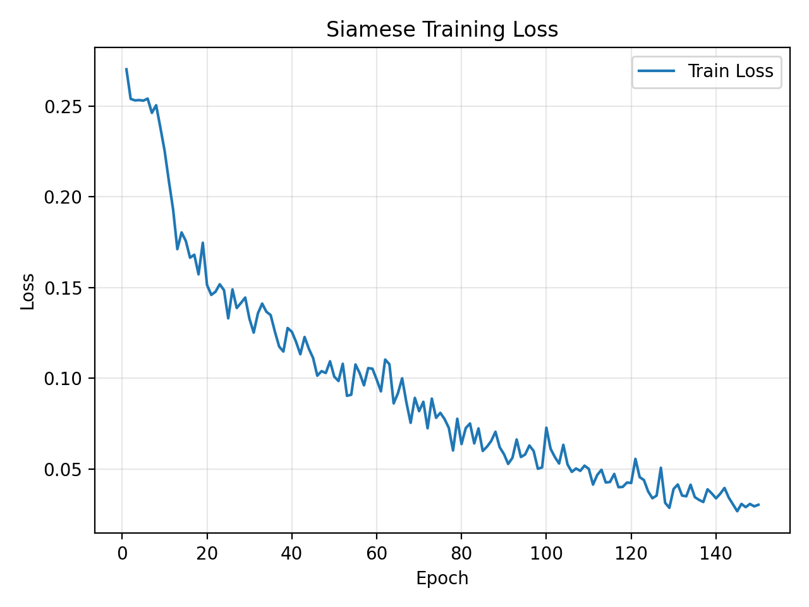
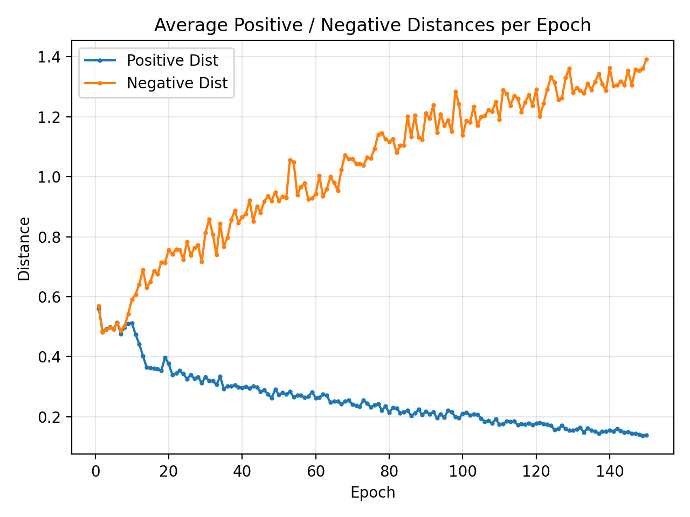
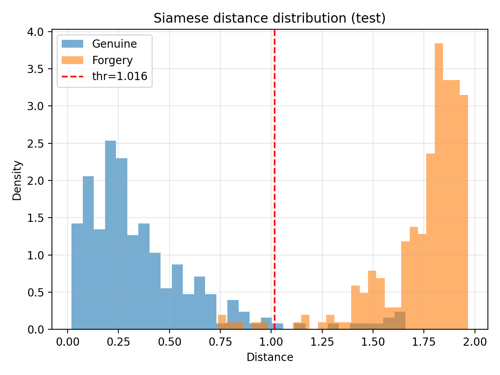
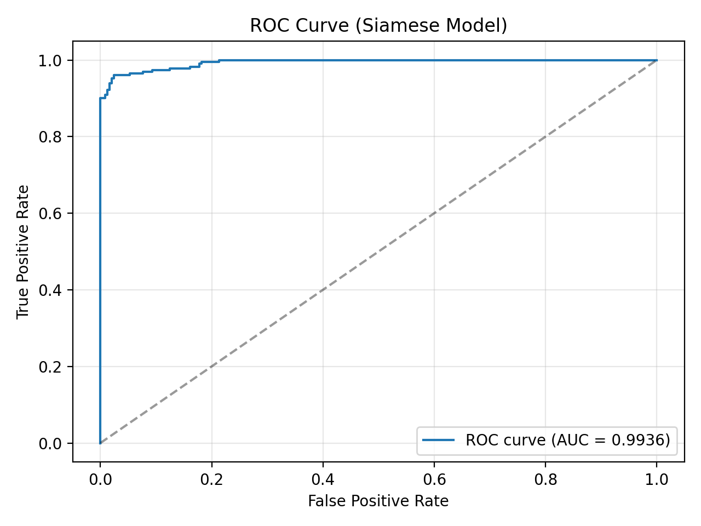
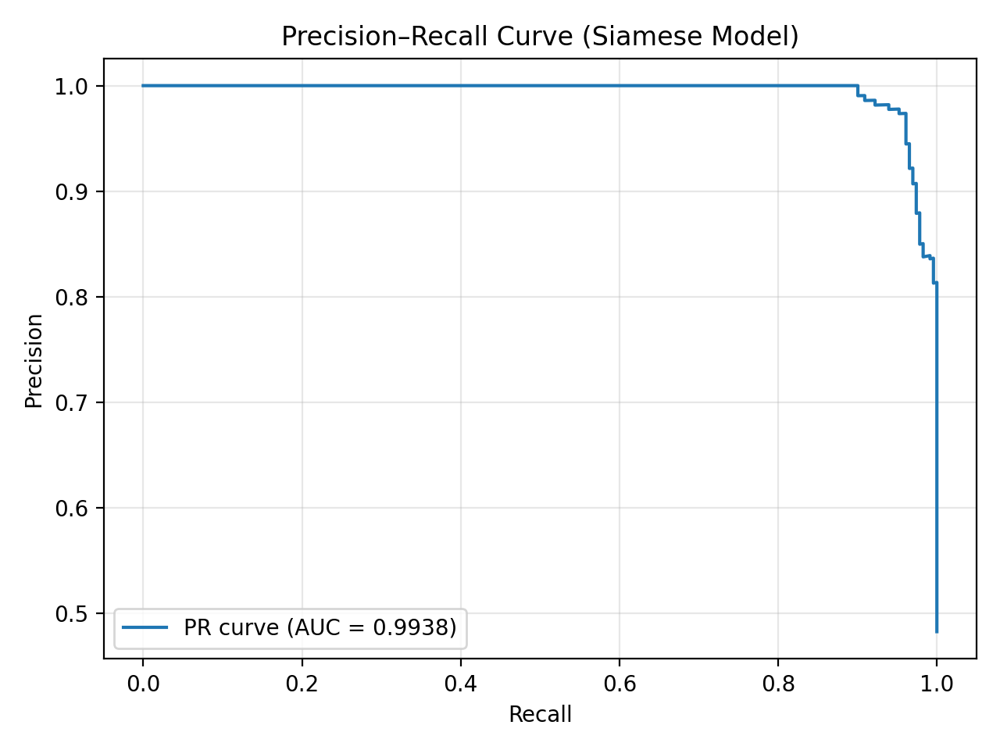

# Direct link to modals: https://drive.google.com/drive/folders/1LX6RKq7uMcwOhMbTLXyJD8Ep2e2FRMjF?usp=sharing
# 🖋️ SignatureNetDB  
### Deep-Learning Based Signature Verification with Siamese & Triplet Networks + Identity Database

---

## 📌 Overview
**SignatureNetDB** is a full end-to-end signature verification system combining deep learning, preprocessing, and a structured user database.

This project allows:
- High-accuracy signature comparison using **Siamese** or **Triplet** embeddings  
- Storing multiple user signatures in a **database**
- Averaging signature embeddings to create a **stable identity vector**
- Verifying if:
  - A signature belongs to a specific user (via NO)
  - A queried signature exists in the database
  - Two input signatures match
- Switching between Siamese & Triplet models dynamically

---

## 🧠 Deep Learning Models

### ✔️ Siamese Network
- Contrastive Loss  
- Learns pairwise similarity  
- Best threshold found during evaluation (example): `~1.21`

### ✔️ Triplet Network
- Triplet Loss (Anchor-Positive-Negative)
- Learns better separation in embedding space  
- More robust for unseen signatures

Both models operate on:
Input shape : 1 × 400 × 400
Output embedding : 128-dimensional L2-normalized vector

---

## 🖼️ Preprocessing Pipeline (400×400)
Every signature image passes through:

1. Convert to grayscale  
2. Optional autocontrast  
3. Resize while preserving aspect ratio  
4. Center-pad into a **400×400 white canvas**  
5. Convert to tensor + normalize(`mean=0.5, std=0.5`)

The preprocessing is identical across:
- Training  
- Validation / Test evaluation  
- GUI real-time prediction  

---

## 🏋️ Training
Training scripts include:
- Hard-negative sampling  
- On-the-fly data augmentation:
  - Random rotation  
  - Small translations  
  - Light brightness/contrast jitter  

Training supports:
- Best-model saving  
- Last-checkpoint saving  
- Full loss logging  
- CUDA acceleration  

Example training output loss:  
Initial loss: ~1.00
Final best loss: ~0.13

---

## 📊 Evaluation
`siamese_evaluate.py` computes:

- All distances (genuine vs forgery)
- Optimal threshold search
- Accuracy, FP, FN, TP, TN

 Training Metrics For Main Siamese Model:

   

 Evaluation Metrics

   

 Precision–Recall Curve

  

---

## 🗄️ Database System

Each registered user has:

| Field | Description |
|-------|-------------|
| **NO** | Primary Key |
| **Name** | First name |
| **Surname** | Last name |
| **Signatures** | Multiple PNG signature samples (stored in a separate table) |
| **Embedding** | Mean embedding vector of all user signatures |

### Why average the embeddings?
- Allows more stable identity representation  
- Reduces variance between signature samples  
- Works with **1 or many signatures**  

---

## 🔍 Supported Database Queries

### ✔️ 1) “Does this signature belong to user NO=X?”
- Compute embedding  
- Compare with stored user embedding  
- Apply threshold  
- Return **Genuine / Forgery**  

### ✔️ 2) “Give me NO from Name+Surname”
Simple lookup in the database.

### ✔️ 3) “Whose signature is this?”
- Compute embedding  
- Compare against **all stored embeddings**  
- Return the best match (if below threshold)

### ✔️ 4) “Verify two PNG signatures”
- Pure model-based matching  
- No database math needed  

---

## 🖥️ GUI Application

The desktop GUI includes:

- Loading two signature images  
- Real-time preprocessing visualization  
- Switching between Siamese & Triplet models  
- Distance + final decision output (color coded)  

GUI internally:
- Preprocesses images  
- Converts to tensor  
- Runs the chosen model  
- Displays both processed signatures (denormalized)
- Outputs similarity score  

---
## 🤝 Contributors
**Efe Görkem Akkanat** — Siamese Modal, GUI, Database Management.
